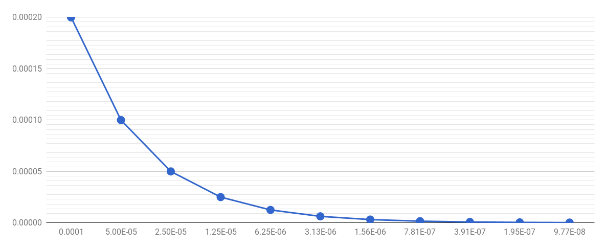
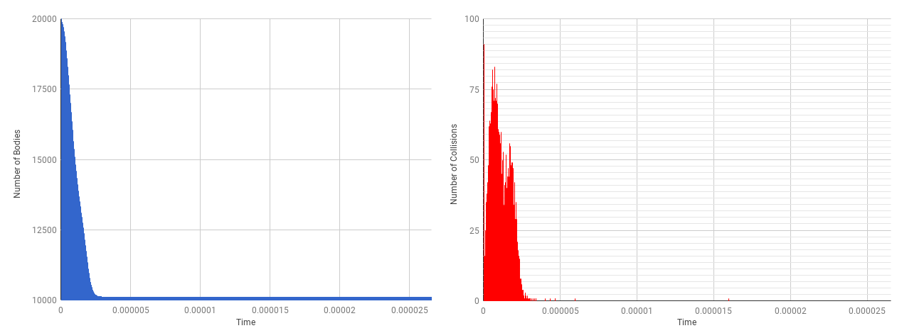
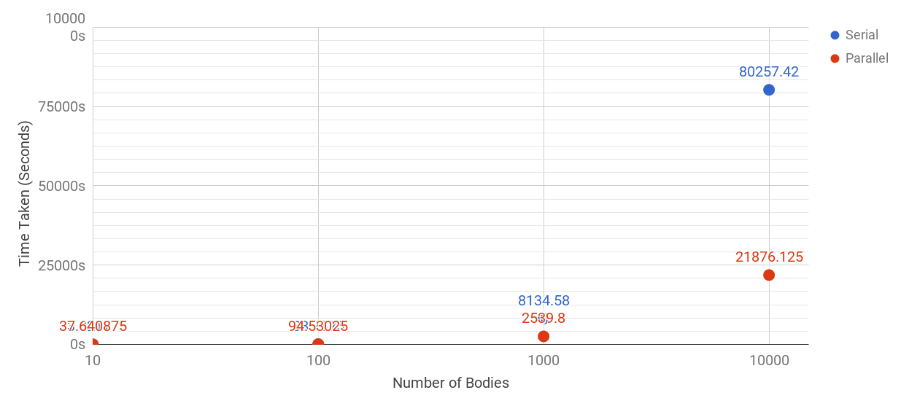
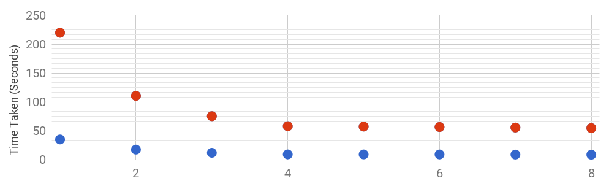

<!--
The report may not exceed two pages (incl. pictures/figures) for the Steps 2,4 and 5, 
i.e. it may not exceed six pages in total.
-->
# 1. A Multi-Body Galaxy Simulation

A video describing how the program works can be found [here](https://youtu.be/o8MChcniRzM) ([https://youtu.be/o8MChcniRzM](https://youtu.be/o8MChcniRzM)).

<!-- derive the formulae and present it in the report -->
In the event of a collision, the displacement of the new body is calculated using the midpoints of the positions of the collided bodies. The new velocity is calculated using mass averaged velocities, i.e. the velocities of the collided bodies are divided by their mass. They are then summed together to create the new velocity for the newly formed body.

# 2. Numerical Experiments

## Consistency & Convergence
<!-- Part 2 is 40 marks -->
<!-- 
Study two particles. Choose their velocity and initial position such
that they directly collide with each other. Create a table where you document the
resulting/merged particles position. Study this position for various time step size choices
(switching off the adaptive time step size choice from Step 1 question 3 above) and compare
these positions to runs where you switch on the feature from Step 1 question 3. Can you
uncover the convergence order of your scheme? Compare the obtained accuracy also to cost
in terms of time step count.
-->

The table below describes the information related to the two bodies used for the collision experiment.

| Body ID |  $s(x)$ |  $s(y)$ |  $s(z)$ |  $v(x)$ |  $v(y)$ |  $v(z)$ | Mass |
|--------+---------+---------+---------+---------+---------+---------+------|
| 1 | +0.1 | +0.1 | +0.1 | -2.0 | -2.0 | -2.0 | $1e^{-11}$ |
| 2 | -1.0 | -1.0 | -1.0 | +2.0 | +2.0 | +2.0 | $1e^{-11}$ |

As the mass is negligible, its effect on the force is also negligible. This helps to predict where the bodies will collide; it occurs at $(x,y,z) = (-0.45 -0.45 -0.45)$ at time $t=0.2$. The error is calculated using the distance between the position of one body and the actual position upon collision. We calculate the error of only one dimension; $x$, as the other dimensions ($y,z$) would follow the same values. The adaptive timestep has a baseline value of $10^{-4}$ and reduces contingent to how close two bodies are close to colliding towards each other. Adaptive holds a hard limit of $10^{-10}$. _The adaptive timestep technique is described in more detail in the video, linked above._

<!-- | Timestep $h$ |  Error $\overline{u}_{h}$ |  $x_{a}$ |  $x_{b}$ |  Ratio |  Steps | Error Range | C |
|------+------+------+------+-----+------+------+------|
|Adaptive|0.000001997990|-0.449998|-0.450002|0.500503|1716457|0.000003994500|N/A|
|$10^{-6}/2^1$|0.000001999990|-0.449998|-0.450002|0.500003|275000|0.000003998500|N/A|
|$10^{-6}/2^2$|0.000001000020|-0.449999|-0.450001|0.499992|550000|0.000001998520|1.999704035|
|$10^{-6}/2^3$|0.000000499961|-0.45|-0.45|0.500039|1100000|0.000000998475|2.001092468|
|$10^{-6}/2^4$|0.000000250068|-0.45|-0.45|0.499865|2200000|0.000000498564|1.999303944|
|$10^{-6}/2^5$|0.000000125078|-0.45|-0.45|0.499688|4400000|0.000000248608|1.985730196|
|$10^{-6}/2^6$|0.000000062134|-0.45|-0.45|0.502946|8800000|0.000000123183|2.070195922| -->

| Timestep $i$ |  Error $F$ |  $x_{a}$ |  $x_{b}$ |  Steps | Error Range | C | Ratio |
|------+------+------+------+-----+------+------+----|
|Adaptive|0.000001997990|-0.449998|0.500503|1716457|0.00000399450|N/A| 0.292 |
|$10^{-6}/2^1$|0.000001999990|-0.449998|0.500003|275000|0.00000399850|N/A| 1.818 |
|$10^{-6}/2^2$|0.000001000020|-0.449999|0.499992|550000|0.00000199852|1.9997| 1.818 |
|$10^{-6}/2^3$|0.000000499961|-0.45|-0.45|1100000|0.00000099848|2.0010| 1.818 |
|$10^{-6}/2^4$|0.000000250068|-0.45|-0.45|2200000|0.00000049856|1.9993| 1.818 |
|$10^{-6}/2^5$|0.000000125078|-0.45|-0.45|4400000|0.00000024861|1.9857| 1.829 |
|$10^{-6}/2^6$|0.000000062134|-0.45|-0.45|8800000|0.00000012318|2.0701| 1.791 |

<!-- | Timestep $h$ |  Error $\overline{u}_{h}$|  $x_{a}$ |  $x_{b}$ |  Ratio |  Steps | Error Range | 
|------+------+------+------+-----+------+------+------|
|Adaptive|0.000001997990|-0.449998|-0.450002|0.500503|1716457|0.000003994500|
|$10^{-6}/2^1$|0.000001999990|-0.449998|-0.450002|0.500003|275000|0.000003998500|
|$10^{-6}/2^2$|0.000001000020|-0.449999|-0.450001|0.499992|550000|0.000001998520|
|$10^{-6}/2^3$|0.000000499961|-0.45|-0.45|0.500039|1100000|0.000000998475|
|$10^{-6}/2^4$|0.000000250068|-0.45|-0.45|0.499865|2200000|0.000000498564|
|$10^{-6}/2^5$|0.000000125078|-0.45|-0.45|0.499688|4400000|0.000000248608|
|$10^{-6}/2^6$|0.000000062134|-0.45|-0.45|0.502946|8800000|0.000000123183| -->

<!-- 
|$10^{-6}/2^7$|0.000000031729|-0.45|-0.45|0.492452|17600000|0.000000061368|
|$10^{-6}/2^8$|0.000000014415|-0.45|-0.45|0.541966|35200000|0.000000028684|
|$10^{-6}/2^9$|0.000000006426|-0.45|-0.45|0.607915|70400000|0.000000012311|
|$10^{-6}/2^{10}$|0.000000002519|-0.45|-0.45|0.775391|140800000|0.000000004178| -->

A numerical approximation is calculated by determining the order experimentally. We prove linear convergence  $(p=1)$ by attempting to prove a consistent constant, $C$. We use the formula $|F^{(i+1)} - F^{(i)}| \leq C|F^{(i)} - F^{(i-1)}|^{p}$ to compute multiple constants $C_{i}$. The objective is to show that the various $C_{i}$ are roughly equivalent to each other, making a constant $C$. 

The various C values ($C = \frac{u_{h} - u_{h/10}}{u_{h/10} - u_{h/100}}$) computed shows a approximation around $C \approx 2$. This allows us to confirm that the code converges in a linear fashion. 

In our experiment, the adaptive timestep uses more iterations than $h=10^{-6}/2^1$ to reach the collision but produces a similar error, but this is due to the initial positions of the bodies. Choosing a larger range will help. However, choosing a larger initial distance between the bodies would take many more iterations to produce results for the static timesteps. This is also by nature, as the adaptive method chooses a smaller timestep as the bodies become closer to each other.

The ratio is calculated with the formula $R = 1/(F*Steps)$. The larger the ratio the better the accuracy trade off. Our experiment shows that $i = 10^{-6}/2^5$ provides the best trade-off whereas the adaptive timestep provides the worst.
<!-- 

--- -->

## Complexity
<!-- 
Run your code for 10, 100, 1,000, 10,000 particles placed randomly in space.
Derive the runtime complexity of the code and compare it to your experimental data.
-->

Note: _A seed for the Random Number Generator is used to ensure that the sequences of non-repeating numbers used to generate the random bodies are consistent and repeatable, regardless of the body size._

For this section, we assume that the timestep and the limit is fixed. The most dominant function, `updateBodies()`, utilises a nested loop that iterates through every body in the simulation. For each iteration, a force for a given body is calculated by comparing its position against every other body in space. This loop results in a runtime of $O(\alpha \cdot n^2)$. It also includes updating bodies, which takes $O(n)$. Collisions are handled to run in $O(\alpha \cdot n)$, which considers the event that every body could collide. Initialisations consist of having every body set up, which takes at most $O(\alpha \cdot n)$.

Procedures have been taken to reduce the hidden constant $\alpha$ (We assume $\alpha=1$ prior to optimisations.); Each body only calculates its force against bodies that precede them in the order of initiation i.e. Body $2$ calculates force from Body $1$ and Body $0$ whereas Body $3$ calculates from $0,1$ and $2$. Whilst `updateBodies()` would continue to run in $O(n^2)$, the hidden constant would be drastically reduced to a factor of $\frac{1}{2}$ of the original number of calculations needed. There are also other improvements in the program that are based on trading computation time for storage space. Overall, the program would run at most $O(\alpha \cdot n^2)$.

There are also other various optimisations are the compiler level that are not considered during the calculation. The compilation is abstracted from the user. This makes it more difficult to create a fair comparison between real data and theoretical outcomes.

## Statistics
<!-- 
Extend your code such that it keeps track of the number of bodies over time.
Create a plot that shows how the total number of particles decreases over simulation time as
particles merge.
-->

Due to the nature of the bodies interacting with a force, collisions are unpredictable and are likely to fly away as they progress over time. For the sake of this particular simulation, each randomly generated body (using the seed mentioned prior) has a value ranging from -0.000001 to 0.000001 for all of its displacement attributes $(s_x, s_y, s_z)$ and its velocities ($v_x, v_y, v_z$). To improve chances of a collision, the mass for each body would be negligible ($10^{-11}$), and a 20,000 random bodies are initialised. Adaptive time stepping is enabled. The base timestep is $10^{-7}$.

A good portion of bodies are merged upon spawning. This is due to the high chances of bodies having the same positions due to the small range of values that can be generated for the bodies characteristics. It is also noted that simulating the outcome in a larger period of time makes it increasingly unlikely for a collision to occur.

Issues were faced in terms of running the simulation on Paraview due to the number of bodies and the wide spectrum of values produced; i.e values are range from $-10^{-8}$ to $10^{21}$. This is related to how the calculation of the next bodies; where the force calculated can influence the bodies trajectory in a significant manner. It is also noted that collisions improve the running time as there are less bodies to consider during calculation.

#4.  Scaling Experiments

<!-- Repeat the experiments from Step 2 to ensure that your modifications did not break the code. From
hereon, create scaling plots for 10-10,000 particles. You are strongly encouraged to use a University
machine for your plots that has at least 4 cores, i.e. you present a scaling plot than spans at least
1,2,3 and 4 cores. If you have a more powerful machine at home, you are free to use this machine.
Clarify explicitly in your report the machine specifica. -->

To verify that parallel modifications did not break the code, an MD5 sum of the Paraview files computed from both parallel and serial simulations are used to verify differences in results. The computer used consists of a `Intel i7 3770k` processor at a 3.7Ghz clock speed, powering 4 cores (and 8 threads). It utilises 32GB of DDR3 RAM and the storage consists of a SSD connected via a SATA3 interface. It runs a fresh installation of Ubuntu 16.04 LTS and has no other additional programs running. Adaptive timestepping is not utilised as the serial simulation would take too much time, especially in the case for 10,000 bodies. The results are shown in the table below. Parallel programs utilise the full 4 cores/8 threads. For this simulation, bodies are generated in the range of -1 to 1 for its displacement attributes, its velocities, and mass. Bodies are generated serially to ensure that both serial and parallel runs utilise the same bodies.

| Type | CPU Time | Real Time (ms) | Real Time | 
|----+-------+--------+----------|
| Parallel | 10 | 301.127 | 37.640875 | 00:00:37 | 
| Serial | 10 | 3.32177 | 3.32177 | 00:00:03 | 
| Parallel | 100 | 756.242 | 94.53025 | 00:01:34 | 
| Serial | 100 | 88.7825 | 88.7825 | 00:01:28 | 
| Parallel | 1000 | 20318.4 | 2539.8 | 00:42:19 | 
| Serial | 1000 | 8134.58 | 8134.58 | 02:15:34 | 
| Parallel | 10000 | 175009.01 | 21876.125 | 06:04:36 | 
| Serial | 10000 | 81058.82 | 81058.82 | 22:30:58 | 

| Body Count |	10	| 100	 |1000 |	10000 |
|------------+------+------+-----+--------|
| Performance Increase |	0.08824901121	| 0.9391967122	| 3.202842744	 | 3.705355496 |

For larger sets of bodies, parallel programming shows a considerable improvement against serial. The issue where the smaller set of bodies is answered in detail in Question 1. It should be mentioned that the performance increase is measured by looking at the time taken to run the whole simulation. I talk about this in detail in Question 2. All simulations here have been recorded and displayed on Paraview. The video is [here](https://www.youtube.com/watch?v=JAh_YskmOXc) [(https://www.youtube.com/watch?v=JAh_YskmOXc)](https://www.youtube.com/watch?v=JAh_YskmOXc). 

## Questions
<!-- 30 marks -->

1. __How does the scalability for very brief simulation runs depend on the total particle count?__

There is a large overhead involved in terms of initiating a set of threads to be utilised for parallel operations, to the extent that _may take more time than the actual simulation itself._ This includes each thread initiating their own set of variables, and initiating shared set of memory. This was the case for the  10 and 100 bodies simulation, where it is evident that parallelisation affected the timing of the results in a negative manner. For a small operation, it is often better to compute the operation serially.

2. __Calibrate Gustafson’s law to your setup and discuss the outcome. Take your considerations on the algorithm complexity into account.__

Gustafson estimated the speed-up $S$ gained by using $N$ processors (instead of just one) for a task with a serial fraction(which does not benefit from parallelism,) $K$, as $S=N+(1-N)K$. The table below shows the time measurements between serial and parallel times, measured via the CPU time. From here, we can deduce K by looking at the time spent on serial operations as a fraction of the overall time.

| Number of Bodies | Threads $(p)$ | Serial Time | Parallel Time | Total Time $t(p)$ | K | 
|------------------+---------+-------------+---------------+------------+---|
| 20000 | 1 | 0.026708 | 35.1801 | 35.206808 | 0.0007044473923 | 
| 20000 | 2 | 0.028066 | 17.64145 | 17.669516 | 0.0007420183465 | 
| 20000 | 3 | 0.026398 | 12.09363333 | 12.12003133 | 0.0006748307414 | 
| 20000 | 4 | 0.026561 | 9.3316 | 9.358161 | 0.0006612924385 | 
| 20000 | 5 | 0.023714 | 9.29126 | 9.314974 | 0.0004690381061 | 
| 20000 | 6 | 0.020047 | 9.262066667 | 9.282113667 | 0.0003273934802 | 
| 20000 | 7 | 0.026727 | 9.008214286 | 9.034941286 | 0.0003931372192 | 
| 20000 | 8 | 0.028578 | 8.795575 | 8.824153 | 0.0003793082384 | 
| 50000 | 1 | 0.055767 | 219.885 | 219.940767 | 0.0002255879951 | 
| 50000 | 2 | 0.054913 | 110.6975 | 110.752413 | 0.0002318856395 | 
| 50000 | 3 | 0.057161 | 75.45833333 | 75.51549433 | 0.0002303044535 | 
| 50000 | 4 | 0.055998 | 58.141 | 58.196998 | 0.0002340699913 | 
| 50000 | 5 | 0.04972 | 57.4432 | 57.49292 | 0.0002192463943 | 
| 50000 | 6 | 0.054618 | 56.70416667 | 56.75878467 | 0.0001566519646 | 
| 50000 | 7 | 0.049742 | 55.82085714 | 55.87059914 | 0.000146939975 | 
| 50000 | 8 | 0.056105 | 54.79475 | 54.850855 | 0.0001151510654 |

As the processor in question includes hyper-threading, it may obfuscate the results in some manner. The program depends on its floating point operations. The use of hyper-threading provides the illusion of 8 threads, whereas in reality, floating point registers are shared between a virtual thread and a physical core, reducing the effectiveness of the extra threads. This is shown in the table above, where diminishing returns can be seen from 4 threads onwards. This is also visualised in Figure 3. For the calculations, we ignore any $p>4$.

We use the formula $t(1) = f \cdot t(p) + (1-f) \cdot t(p) \cdot p$, where $f$ represents the ratio of the serial fraction, and $p$ represents the number of threads utilised. $t(p)$ represents the time utilised given $p$ threads. To calculate $f$, our problem sizes will need to be fixed. I use both 50,000 and 20,000 bodies as separate calculations. The large body sizes are used to overcome parallel overheads involved. Using $p$ as 4 and 2, we use a simple simultaneous equation $f \cdot (t(4)) + (1-f) \cdot t(4) \cdot 4 = f \cdot (t(2)) + (1-f) \cdot t(2) \cdot 2$.

For 50,000 bodies, $f = 0.1767$ and for 20,000 bodies, $f = 0.2012$.

This presents a speedup of $s = 3.47$ for 50,000 bodies on 4 threads, and $s=3.396$ for 20,000 bodies on 4 threads. Gustafson's law neglects some concurrency overhead, however which may explain the difference between the speedup calculated here and what the results show. Using Amdahl's law shows $s=3.76$ for 20k bodies on 4 threads, and $s=3.78$ for 50k bodies.

<!-- $t(1) = f\cdot(t(4)) + (1-f) \cdot t(4) \cdot 4 = f \cdot (t(2)) + (1-f) \cdot t(2) \cdot 2 $

$174.590994f + 232.787992 = 110.752413f + 221.504826$
$-63.83858f = -11.283172$ 
$f = 0.17674534740591036$
-->

<!-- For 20,000 bodies, The same procedure applies. -->

<!-- $f = 0.20121274771943057$ -->
<!-- It depends on whether you fix the problem size.
It hence depends on your purpose.
It is crucial to clarify assumptions a priori.
It is important to be aware of shortcomings. -->

3. __How does the parallel efficiency change over time if you study a long-running simulation?__

As mentioned in Question 1, initiating a set of threads for parallel operations is computationally expensive. However, it is also the case that initiation is done once at the beginning of the program. Over time, the serial operation becomes a smaller fraction of the overall running time. This makes parallel operations the dominant factor in the runtime. This consequently makes the parallel efficiency increase as the threads are more utilised for a longer duration of the simulation.

This is however, assuming that the simulation is running for an extended period of time. If, like question 1 the simulation is run short where the serial operations dominate the running time, the parallel efficiency is considered very low.

# 5. Distributed Memory Simulation
<!-- 20 marks -->
<!-- 
Design a strategy how to parallelise your code with MPI. No implementation is required, i.e. it is a
gedankenexperiment. -->

## Assumptions and Setup

For the sake of simplicity:

- We assume near zero latency for transmission.
- The master-slave model is adopted; the master rank does not perform any major computation; as this is distributed to the slaves

MPI is SPMD (Single program; multiple data), so every CPU in the MPI network has a copy of the same code, but handles different sets of instructions and data based on their rank. We check the ID of their rank to determine whether it is a master or a slave, we call master rank 0. The master has its own set of functions, and so does the slaves.

## Operation

The master rank does not compute heavy operations; this is divided and split between the slaves. The master rank does, however, initiate the data structures that the slaves would utilise, including the bodies, timesteps and other helper variables that are also used in the same style as is the OpenMP program. The contents of the bodies are broadcast to the slaves (via  `MPI_Bcast `) at every iteration, reducing the number of redundant transmissions during the slaves split-computation of the force loop in `updateBodies()`. 

The primary use for parallelization during our OpenMP program was to handle the floating point calculation of forces acting on each body. The master rank splits segments of the loop and distributes them to the slaves  (which could be via  `MPI_Scatter`, but this is contingent on the number of bodies. It may be better to propagate them through other means given a large enough set of bodies, as the MPI buffers could face heavy stress.) 

The master rank also uses an `MPI_send()` to send extra but relevant information to a slave, and the slave receives data using `MPI_recv()`. Received data needs to be verified by checking the status of the received message. (This applies to all messages transmitted; if it isn't a valid response then we should request the message again or have error handlers in place.)

Slaves also have their own local variables that are not necessarily needed to be stored in the shared pool of memory; for instance, variables for inner loops and helper variables that help make code more human-interpretable. Otherwise, `gets` also suffice for a slave to retrieve some data from the global space that they have not already received from a broadcast, for instance, the positions and velocities of bodies.

The distance calculation would be its own function for the MPI program, and is called by slaves to increment the overall force for a given body. It is also used to determine whether two bodies have collided, where a non-blocking `immediate_send` could be initiated from a slave to the master rank, indicating a collision between two bodies.

Once a slave rank has finished computation of a force increment, they are sent back to the master rank via  `MPI_reduce`. The master rank would verify that all the results have been received prior to continuing with the rest of the operations needed to update the bodies.

The adaptive timestep can be computed by having slave nodes calculate potential collisions using various time step sizes. The results would collate back to the master rank to determine the best timestep to utilise.

In terms of updating the bodies, this can again, be distributed across the network in the same vein as how bodies are broadcast to the slaves at the beginning. Like the OpenMP program, the iteration is repeated for each step until the simulation is finished.

<!-- Mark Scheme

- All three features of Step 1 are implemented correctly.
- All three questions from Step 2 are answered correctly.
- Quality of presentation of simulation outputs for Step 2 (graphs, snapshots and notably videos).
- The code is parallelised including the statistics on the total number of objects.
- All three questions from Step 4 are answered correctly.
- A clear concept for MPI parallelisation is presented.
- Quality of writing and quality of presentation of simulation outputs (graphs, snapshots).

 -->